# 📘 MuseLink — AI-Powered Creative Collaboration Platform (Frontend)

**Developed by:** Esha Sabir  
**Hackathon:** Genesis Hackathon 2025  
**Role:** Frontend Engineer & UI Designer  
**Team:**  
- Frontend – Esha Sabir  

---

## 🚀 Overview

**MuseLink** is a next-generation creative collaboration and productivity platform built to empower teams with AI.  
It integrates secure communication, collaborative workspaces, encrypted cloud storage, and AI-powered tools into one sleek dashboard.

MuseLink’s mission: **“Empower creators and teams to ideate, collaborate, and produce with AI — securely and efficiently.”**

---

## 🖼️ Preview — Landing Page
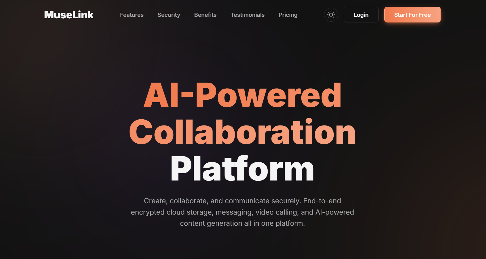


---

## 🔐 Authentication Pages (Login & Signup)
MuseLink provides a secure and aesthetic authentication flow with animated input fields, MFA prompts, and responsive design.
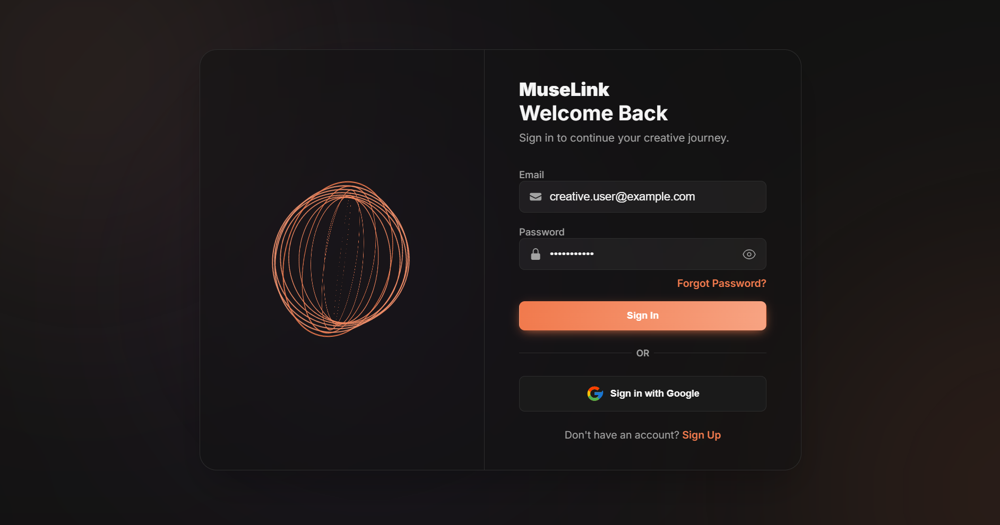
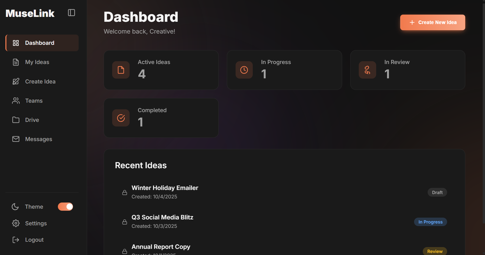

---

## 🧭 Genesis Dashboard Overview
The Genesis Dashboard is the core of MuseLink — your central workspace for projects, tasks, and team communication.
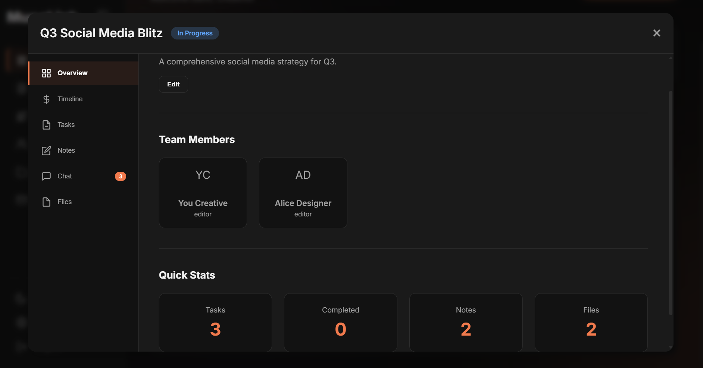

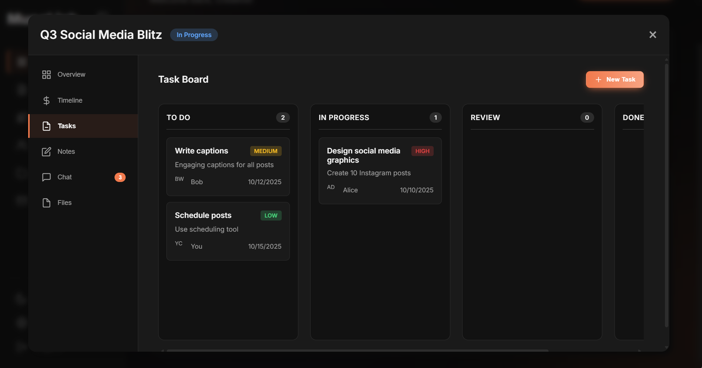
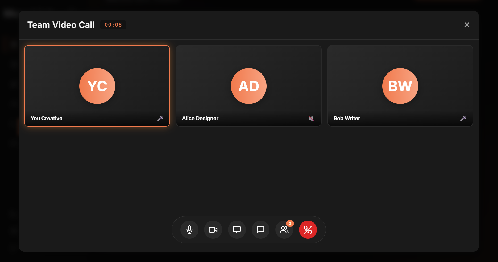
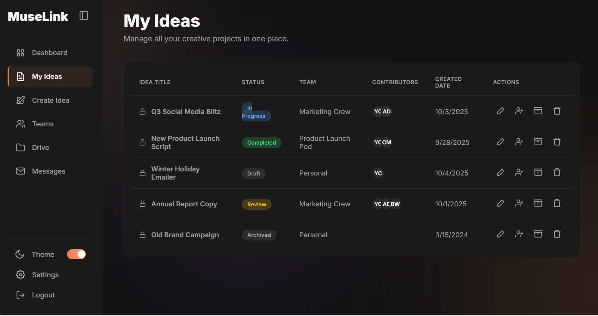
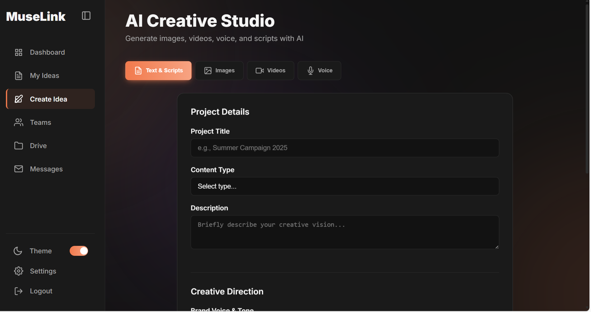
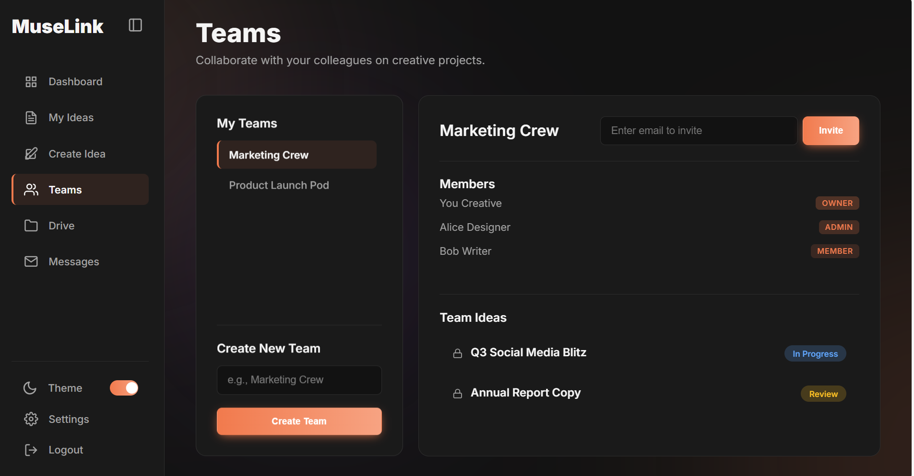
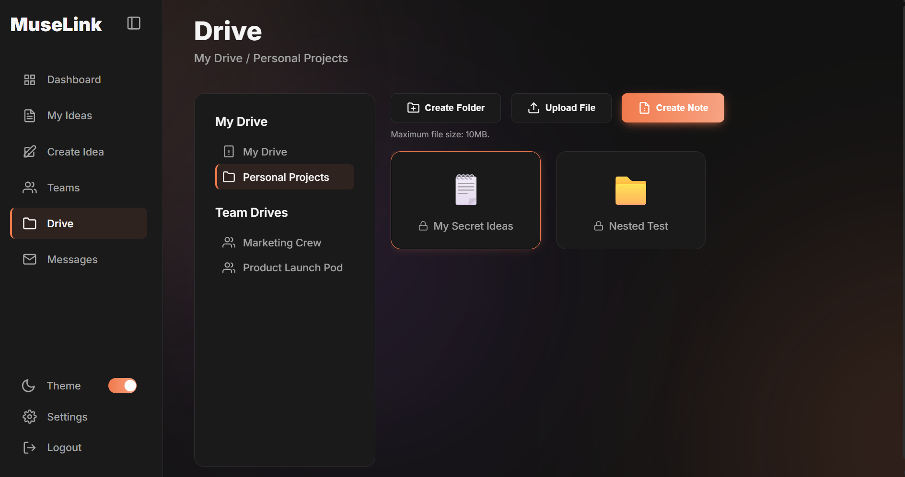

---

## 🎨 AI Creative Studio
MuseLink integrates an AI Studio where users can create content — text, art, voice, or visuals — with smart AI tools.  
Built for creatives, designers, and marketing teams.

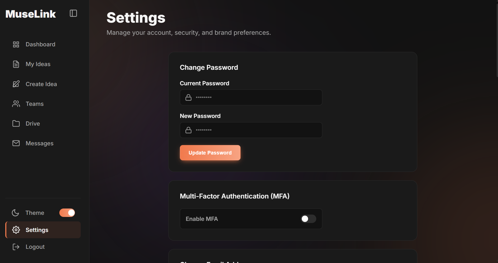
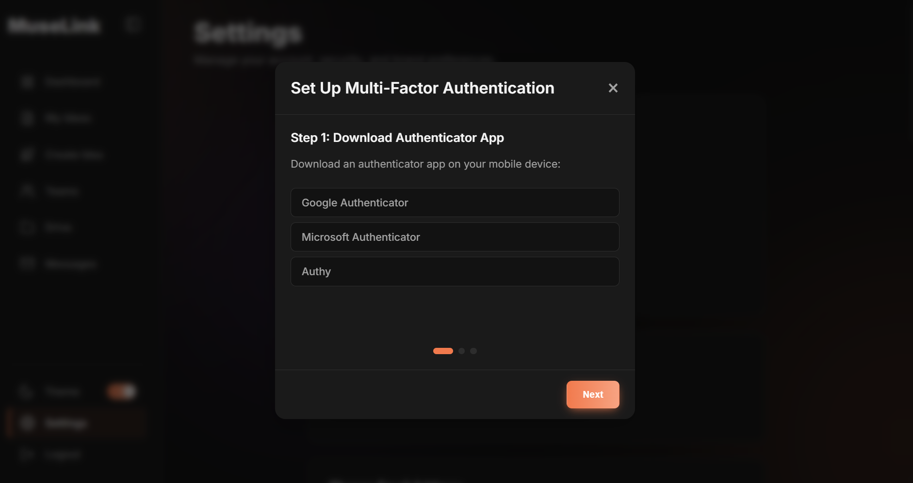
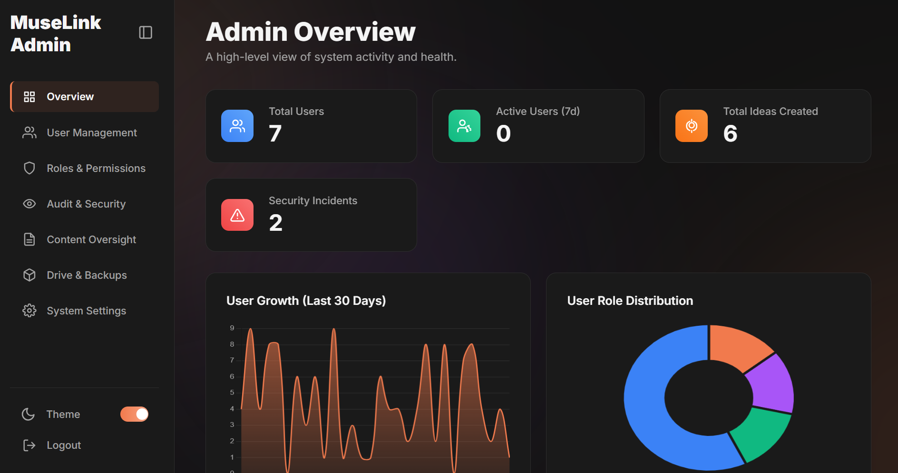
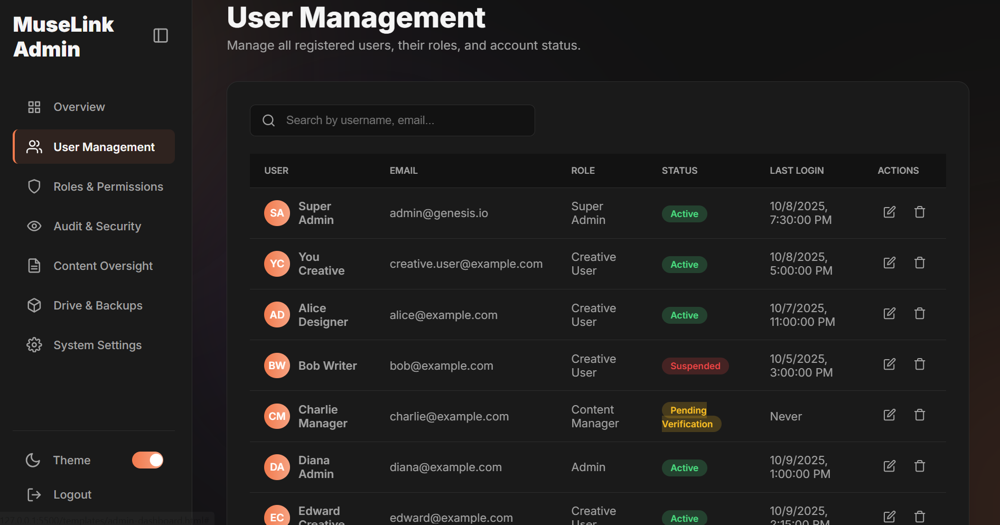

---

## 🗂️ Drive & File Management
MuseLink Drive offers organized cloud storage with encryption, easy uploads, and preview support for team drives.
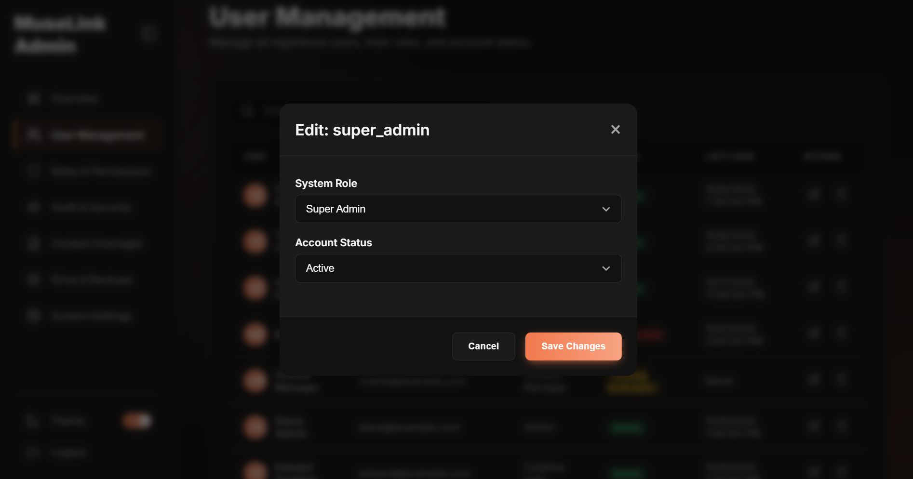
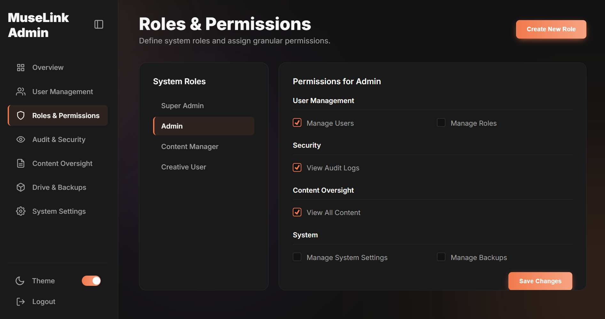
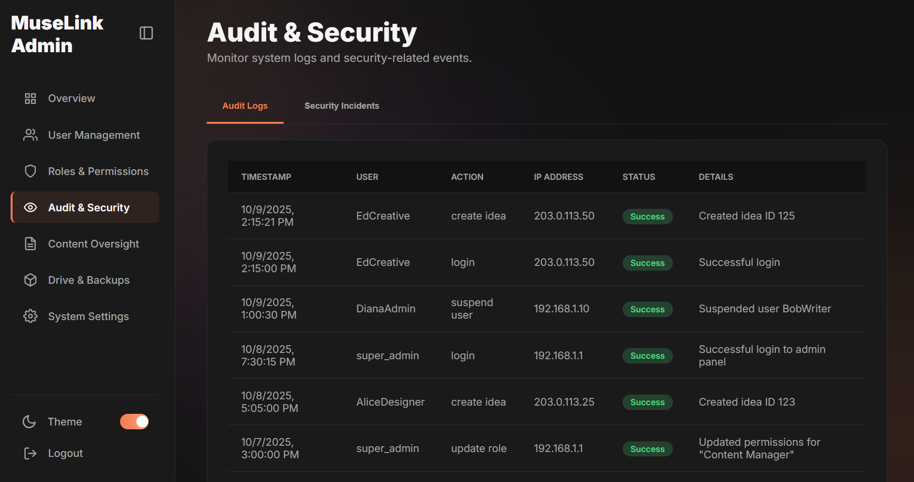

---

## 💬 Team Communication & Settings
Seamless messaging, video calling, and profile management — all within the dashboard interface.
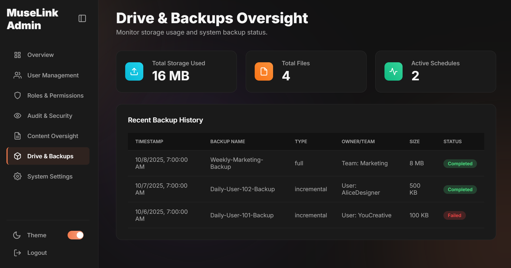
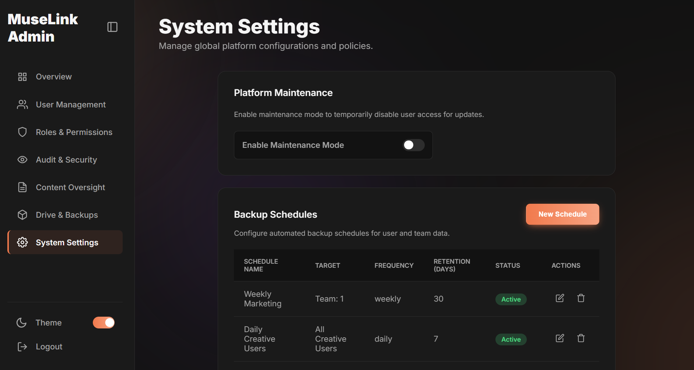

---

## ✨ Key Features

- 🧠 **AI Creative Studio** — Generate text, images, voice, or video content using AI APIs  
- 💬 **Encrypted Chat & Video Calls** — Real-time collaboration with WebRTC  
- 🗂️ **Secure File Drive** — Upload, manage, and share project files  
- 👥 **Team Workspace** — Organize projects, assign tasks, manage notes  
- 🔐 **Account Security** — MFA, encrypted storage, and personal AI tone training  

---

## 🧠 Tech Stack

**Frontend:** HTML5, CSS3, JavaScript (Vanilla), SVG icons, Responsive Design  
**Backend (by teammate):** Node.js, Express.js, MongoDB, WebSocket, JWT Auth, AWS/Firebase

---

## ⚙️ Installation

1. Clone the Repository  
   ```bash
   git clone https://github.com/EsHa-Sabir/muselink.git
   cd muselink
   ```

2. Open with Live Server or use:
   ```bash
   python -m http.server 5000
   ```
   Then open [http://localhost:5000/public/muselink-landing.html](http://localhost:5000/public/index.html)

---

## 📁 Folder Structure

```
MuseLink/
├── templates/
│   ├── index.html
│   ├── auth.html
│   ├── user-dashboard.html
│   ├── admin-dashboard.html
│ 
├── static/
│   ├── css/
│   └── js/
├── screenshots/
└── README.md
```

---

## 🚀 Deployment Options

- GitHub Pages — Deploy from `/public` folder  
- Netlify / Vercel — Build directory = `/public`

---

## 🧩 Integration Checklist

✅ Frontend Complete  
✅ Responsive Design Done  
🕓 Backend API integration pending  
📹 WebRTC setup in progress  
🗄️ Database handled by teammate

---

## 🧰 Future Roadmap

- Add AI API integrations (OpenAI, Stability AI, Whisper)  
- Real-time collaborative document editing  
- Voice-to-text for meeting summaries  
- Enhanced Admin Panel

---

## 💖 Credits

**Frontend:** Esha Sabir  
**Hackathon:** Genesis Hackathon 2025  
**Role:** UI/UX Design + Frontend Dev  
**Team Collaboration:** Frontend (Esha) + Backend (Teammate)

---

## 📝 License

This project is licensed under the **MIT License** — Free to use and modify with attribution.

---

## 🌐 Links

- 🌍 [MuseLink Live Demo](#)
- 💻 [GitHub Repository](#)
- 📬 Contact: eshasabir.dev@gmail.com (optional)
